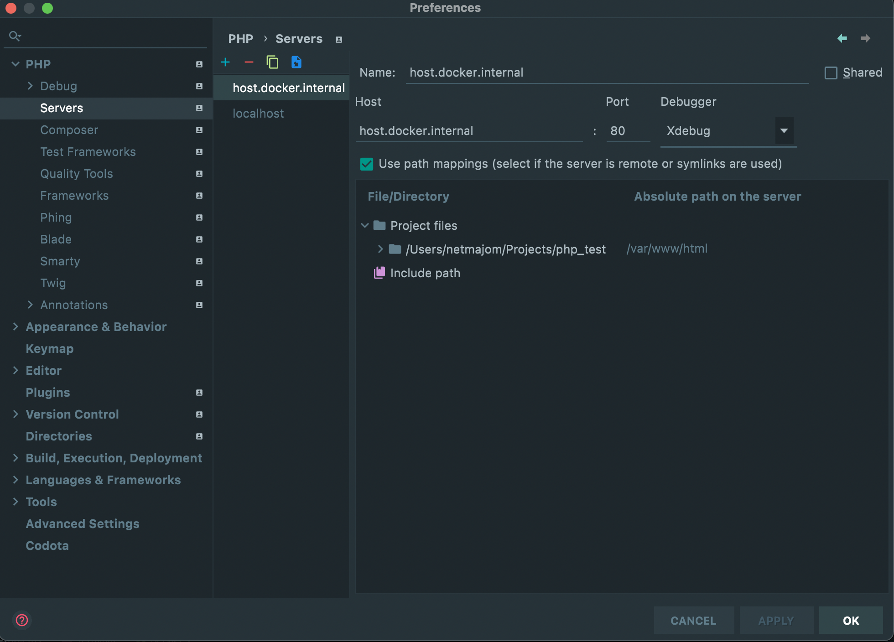
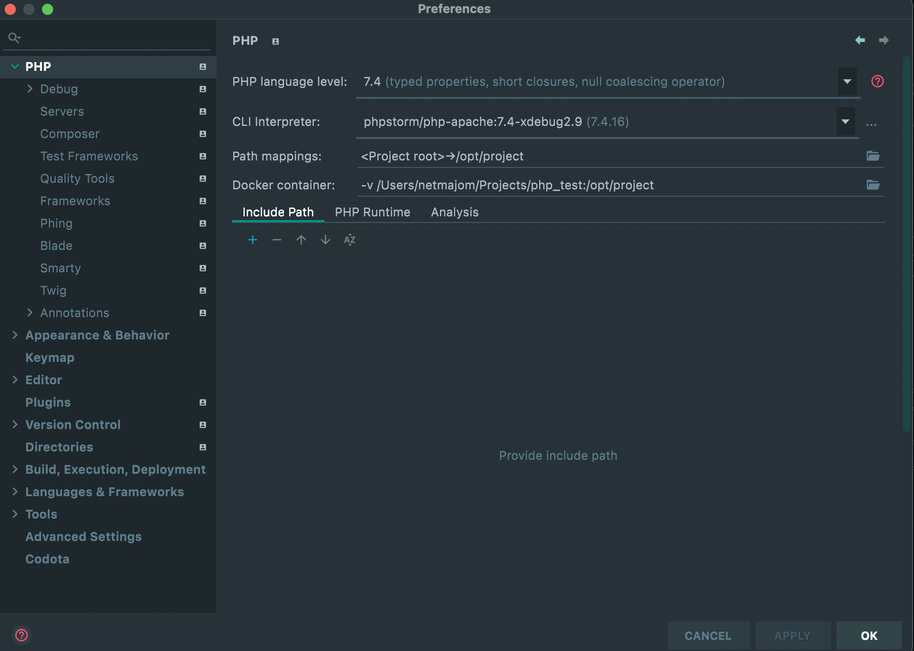
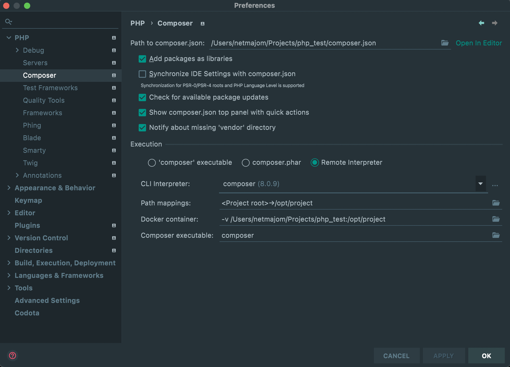
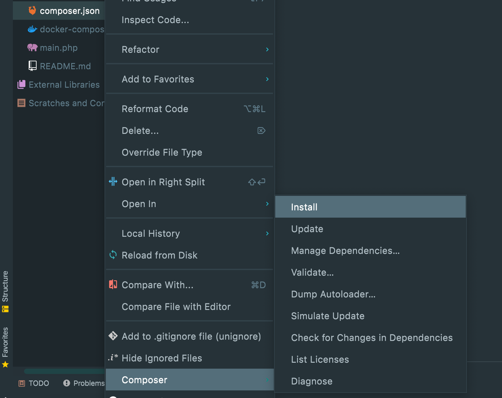
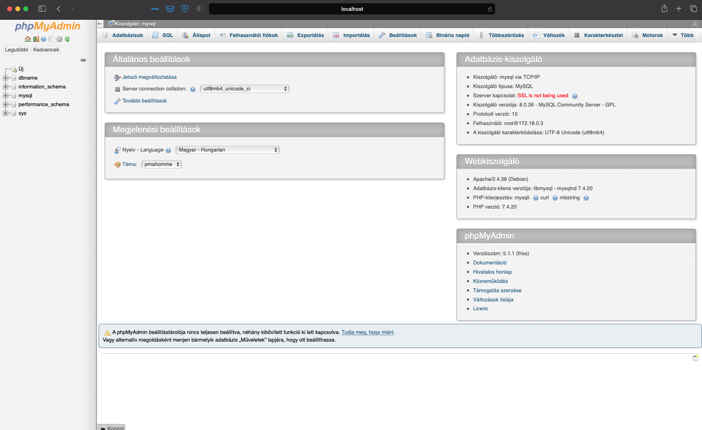
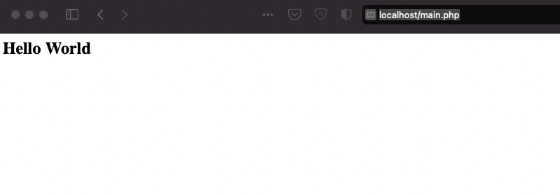

# Dockerize PHP - Apache - XDebug - MySQL _(Mac M1 Compatible)_ - PHPMyAdmin - Composer - Application In PHPStorm

The project purpose, to show how to use your PHP Application in PHPStorm with XDebug, Apache, MySQL - PHPMyAdmin, and Composer with Docker.

_If you use this docker file in windows, or with a non M1 MAC, yoy can easily delete the `platform: linux/x86_64` section from the mysql service in the **docker/compose.yml** file_

My Docker Script very easy, and a fully configured version, to use PHPStorm with Docker

## 1. Run Docker-Composer

* Click right mouse button to the `docker-compose.yml` file in your project view 
* Run the docker-composer.yml

## 2. Settings

* Go to PHPStorm preferences, and choose the Servers option, and add a new server.
* The host name what you need to enter is: `host.docker.internal`
* Then check the host mappings checkbox, and edit the absolut path line, write there `/var/www/html`

### a. PHP Interpreter 

* Click on the PHPStorm Preferences
* Select the PHP Interpreter
* Add a new CLI interpreter
* Click to the + mark, and select the **+** sign, click to the From Docker menu item
* Select your new installed `phpstorm/php-apache:7.4-xdebug2.9` docker container, and hit ok.
  * You may set the PHP Version to 7.4

### b. Composer

You can set the composer settings too

* Go to preferences, and go to composer settings.
* Choose the remote interpreter option
* Like you done it before the PHP cli, set add a new one, and select `composer`

## Test the app

* Install the sample composer file with right mouse burron -> composer install

* Go to PHPMyAdmin, to view the created sample database enter the browser `http:localhost:8080`
  * username: `root`
  * password: `admin`

* Check your browser the main.php file go to: `http://localhost/main.php`

### That's it, so you can go, and make some fun :)
